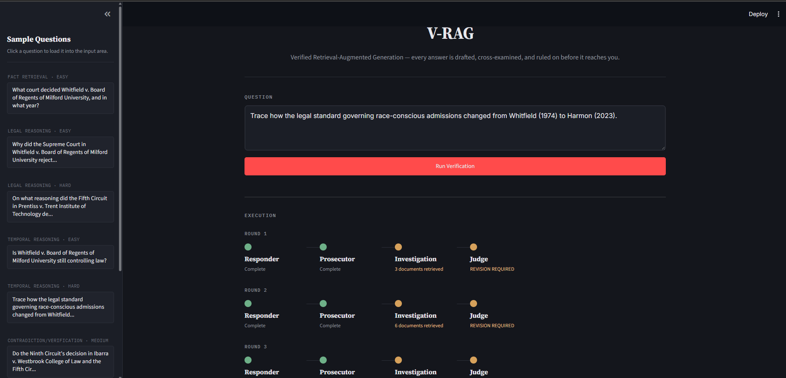
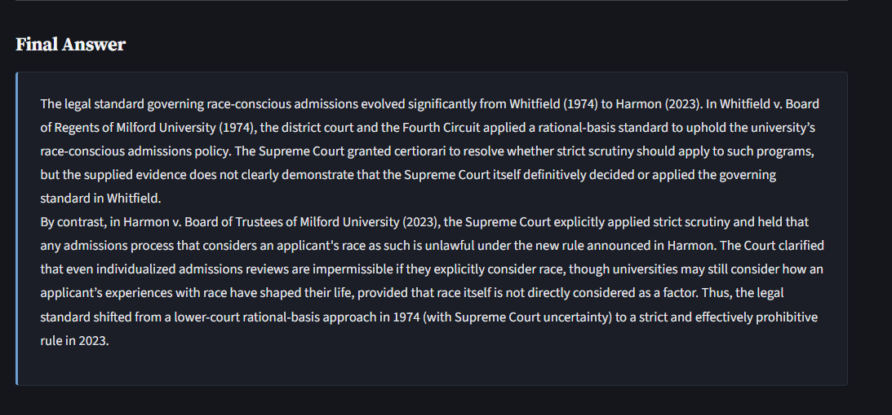
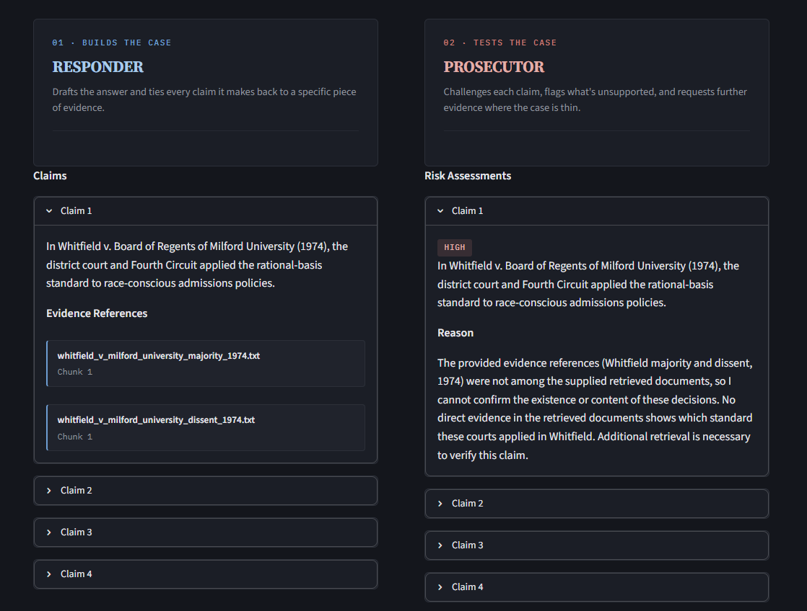
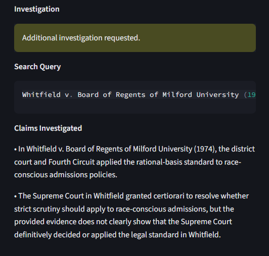
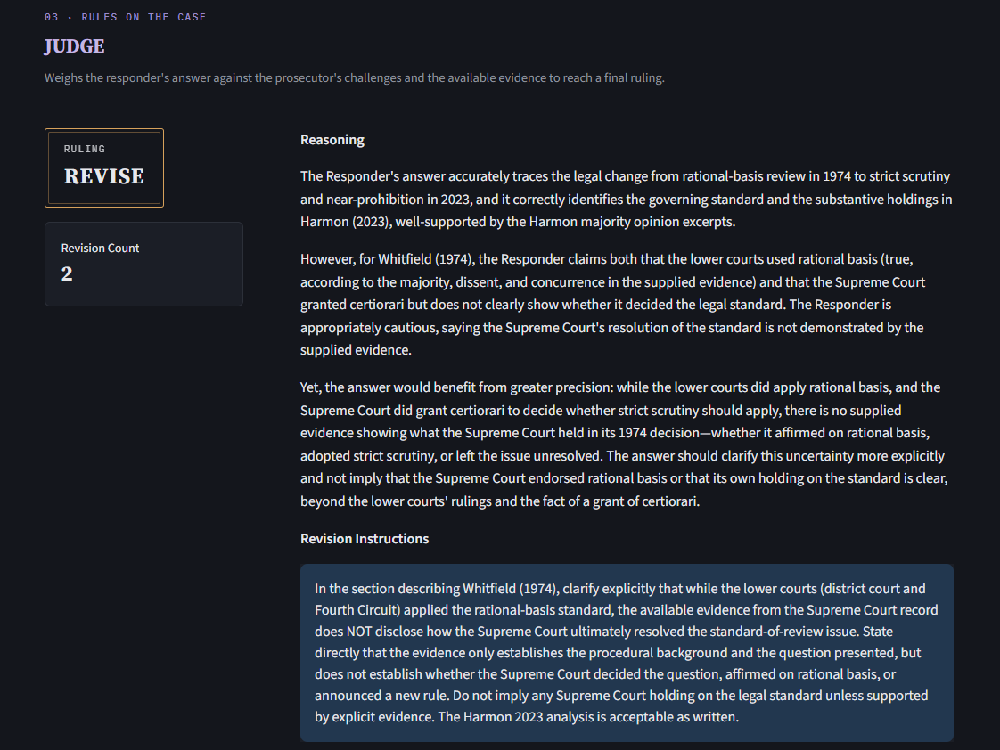
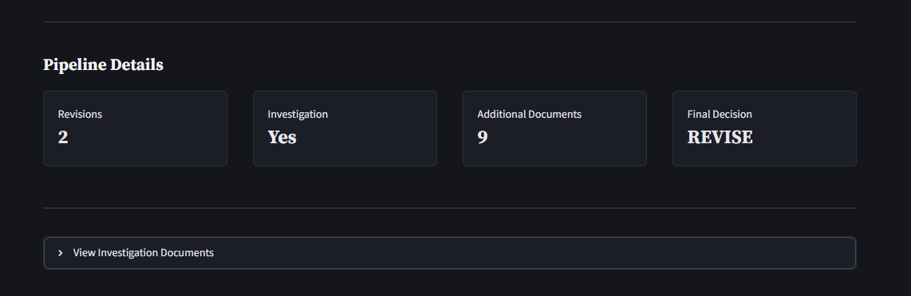

# V-RAG — Verified Retrieval-Augmented Generation

V-RAG is a multi-agent Retrieval-Augmented Generation system designed for **evidence-grounded question answering over a local legal document corpus**.

Unlike a conventional RAG pipeline that retrieves documents and immediately generates an answer, V-RAG introduces a **verification layer** between retrieval and the final response.

The system retrieves relevant evidence, drafts an answer, critically examines its claims, investigates potential weaknesses when necessary, and finally decides whether the answer should be accepted or revised.

The goal is not simply to generate an answer.

The goal is to generate an answer that can **withstand verification against the available evidence**.

---

## Demo

#### Application



#### Final Answer


#### Responder and Prosecutor


#### Investigation


#### Judge


#### Addtional Details



### Video Demo

[![Watch the V-RAG demo]](./assets/video-demo.mp4)

The video demonstrates the end-to-end workflow, including retrieval, claim-level verification, investigation, revision, and final judgment.

---

# The Problem

Traditional RAG systems generally follow a simple pipeline:

```text
Question
   ↓
Retrieve Documents
   ↓
Generate Answer
```

This works well when the retrieved context is sufficient and the model correctly interprets it.

However, legal and other high-precision domains introduce several problems:

- Retrieved evidence may be incomplete.
- A relevant case may be retrieved without the specific section needed to answer the question.
- The model may make a stronger claim than the evidence supports.
- A precedent may have been overruled by a later decision.
- Multiple documents may contain conflicting or evolving interpretations.
- Retrieval can return a relevant case but miss the specific holding required to answer the question.

A conventional RAG system may still produce a confident answer in these situations.

V-RAG is designed to detect and handle these failure modes.

---

# Core Idea

V-RAG separates **answer generation** from **answer verification**.

```text
                    ┌─────────────────┐
                    │     Question    │
                    └────────┬────────┘
                             ↓
                    ┌─────────────────┐
                    │    Retrieval    │
                    └────────┬────────┘
                             ↓
                    ┌─────────────────┐
                    │    Responder    │
                    │                 │
                    │ Generates an    │
                    │ evidence-based  │
                    │ answer          │
                    └────────┬────────┘
                             ↓
                    ┌─────────────────┐
                    │    Prosecutor   │
                    │                 │
                    │ Challenges the  │
                    │ response and    │
                    │ identifies risk │
                    └────────┬────────┘
                             ↓
                       Investigation
                       when required
                             ↓
                    ┌─────────────────┐
                    │      Judge      │
                    │                 │
                    │ Evaluates the   │
                    │ verified answer │
                    └────────┬────────┘
                             ↓
                    Accept / Revise
```

If the answer is accepted, it becomes the final response.

If the answer requires revision, the system sends the relevant feedback and additional evidence back to the Responder and repeats the verification process, subject to a maximum revision limit.

---

# System Architecture

V-RAG consists of several stages.

## 1. Document Ingestion

The ingestion pipeline processes the local legal corpus.

Documents are:

1. Loaded from the source corpus.
2. Split into manageable chunks.
3. Enriched with document-level metadata.
4. Converted into enriched representations for embedding.
5. Embedded using an OpenAI embedding model.
6. Stored in a persistent Chroma vector database.

Each chunk retains information such as:

- Case name
- Citation
- Court
- Decision date
- Year
- Opinion type
- Author
- Topic
- Status
- Overruled-by information
- Source document
- Chunk identifier

The metadata preserves the identity and provenance of each piece of evidence.

---

# 2. Enriched Retrieval

A major part of V-RAG is the use of **metadata-enriched chunk representations**.

Instead of embedding only the raw text contained in a chunk, the embedding representation includes relevant case information alongside the chunk.

For example:

```text
Case: Harmon v. Board of Trustees of Ashworth University
Citation: 601 U.S. 118 (2023)
Court: Supreme Court
Year: 2023
Opinion Type: Majority
Topic: Overruling of Diversity Rationale

Holding:

The Court overrules Whitfield, Calloway, Reyes, and Voss...
```

This allows the embedding model to understand both:

- **what the chunk says**, and
- **which legal document the chunk belongs to**.

The original metadata remains attached to the stored document for provenance and filtering; the enriched representation is primarily used to improve semantic retrieval.

---

# 3. Retrieval

When a question is submitted, V-RAG performs semantic similarity search against the Chroma vector store.

```text
Question
   ↓
Embedding
   ↓
Chroma similarity search
   ↓
Top-k relevant chunks
```

The retrieved documents become the **original evidence** available to the Responder.

---

# 4. Responder Agent

The Responder produces the initial evidence-grounded answer.

Its responsibilities are to:

- Understand the question.
- Analyze the retrieved evidence.
- Produce an answer grounded in that evidence.
- Identify the important claims made in the answer.
- Attach evidence references to supported claims.

The Responder is explicitly instructed not to invent facts, cases, citations, sources, or legal conclusions.

Its structured output contains:

```text
ResponderOutput
├── answer
└── claims
    ├── claim_text
    └── evidence_references
```

This allows later agents to evaluate the response at the **claim level** rather than treating it as one unstructured block of text.

---

# 5. Prosecutor Agent

The Prosecutor acts as an adversarial reviewer.

Its purpose is to find weaknesses in the Responder's claims.

Each important claim receives a risk assessment:

```text
Low
Medium
High
```

The Prosecutor looks for:

- Unsupported claims
- Overstated conclusions
- Missing evidence
- Outdated precedent
- Contradictory evidence
- Important omissions
- Claims requiring additional investigation

When a material issue is identified, the Prosecutor creates an investigation request.

```text
Claim:
Whitfield is the controlling precedent.

Risk:
High

Investigation:
Retrieve evidence concerning later precedent
and its effect on Whitfield.
```

---

# 6. Investigation Agent

Investigation is conditional.

Additional retrieval is performed only when the Prosecutor identifies a material uncertainty or weakness.

The Prosecutor generates a targeted investigation query, which is then used to retrieve additional evidence.

```text
Initial evidence
       +
Investigation evidence
       ↓
      Judge
```

The additional evidence is kept separate from the original retrieval context so the system can distinguish between evidence initially available to the Responder and evidence discovered during verification.

---

# 7. Judge Agent

The Judge performs the final verification.

It receives:

- The original question
- Responder output
- Prosecutor assessment
- Original retrieved evidence
- Additional investigation evidence

The Judge produces one of two decisions:

```text
Accept
```

or

```text
Revise
```

If accepted, the workflow terminates.

If revision is required, the Judge provides revision instructions to the Responder.

---

# 8. Revision Loop

V-RAG can iteratively revise an answer when verification identifies a material problem.

```text
Responder
    ↓
Prosecutor
    ↓
Investigation
    ↓
Judge
    ↓
  Revise
    ↓
Responder
```

During revision, the Responder receives:

- Its previous answer
- Judge revision instructions
- Original evidence
- Additional investigation evidence

The revised answer is then evaluated again.

A maximum revision count prevents uncontrolled iteration.

---

# Complete Workflow

```text
                         ┌──────────────┐
                         │   Question   │
                         └──────┬───────┘
                                ↓
                         ┌──────────────┐
                         │  Retrieval   │
                         └──────┬───────┘
                                ↓
                         ┌──────────────┐
                         │  Responder   │
                         └──────┬───────┘
                                ↓
                         ┌──────────────┐
                         │  Prosecutor  │
                         └──────┬───────┘
                                ↓
                    Investigation Required?
                         /              \
                       No                Yes
                       ↓                  ↓
                 ┌──────────┐     ┌───────────────┐
                 │  Judge   │ ←── │ Investigation │
                 └────┬─────┘     └───────────────┘
                      ↓
                 Accept / Revise
                   /        \
               Accept       Revise
                 ↓             ↓
               END        Responder
                              │
                              └──→ Verification Loop
```

The workflow is orchestrated using **LangGraph**, which maintains state and dynamically routes execution based on the outputs of the verification agents.

---

# Why Multiple Agents?

Each agent has a deliberately different responsibility.

| Agent | Responsibility |
|---|---|
| **Responder** | Generate an evidence-grounded answer |
| **Prosecutor** | Challenge the answer and identify weaknesses |
| **Investigator** | Retrieve targeted evidence for unresolved issues |
| **Judge** | Decide whether the answer is sufficiently supported |

The separation prevents answer generation and verification from being treated as one step.

The Prosecutor is intentionally adversarial, while the Judge acts as the final decision-maker.

---

# Structured Verification

V-RAG does not treat an answer as a single piece of text.

The Responder produces explicit claims:

```text
Answer
│
├── Claim 1
│   └── Evidence references
│
├── Claim 2
│   └── Evidence references
│
└── Claim 3
    └── Evidence references
```

The Prosecutor evaluates these claims individually.

This makes it possible to identify exactly which part of an answer is unsupported or requires further investigation.

---

# Example

Consider the question:

> What is the current controlling Supreme Court precedent on whether a university may consider race in admissions?

An initial retrieval may surface an older case:

```text
Whitfield v. Milford University (1974)
```

The Responder may initially identify Whitfield as controlling.

The Prosecutor notices evidence of a later Supreme Court decision:

```text
Harmon v. Board of Trustees of Ashworth University (2023)
```

It flags the original conclusion and requests investigation.

The Investigation stage retrieves the relevant holding:

```text
The Court overrules Whitfield, Calloway, Reyes, and Voss...
```

The Judge can then determine that the original answer requires correction.

The Responder revises its answer using the newly retrieved evidence.

This demonstrates the central V-RAG loop:

```text
Retrieval finds evidence.
Generation interprets evidence.
Verification challenges that interpretation.
Investigation resolves uncertainty.
Judgment determines whether the answer is ready.
```

---

# Transparency

The Streamlit interface exposes the intermediate verification artifacts rather than displaying only the final answer.

It can show:

- Final answer
- Responder claims
- Evidence references
- Prosecutor risk assessments
- Investigation requests
- Additional evidence
- Judge decision
- Revision count
- Execution timeline

This makes the verification process inspectable and demonstrates how the final answer was produced.


---

# Technology Stack

- **Python**
- **LangChain**
- **LangGraph**
- **OpenAI Embeddings**
- **OpenAI Chat Models**
- **Chroma**
- **Pydantic**
- **Streamlit**
- **LangSmith**

---

# Project Structure

```text
V-RAG/
│
├── agents/
│   ├── prompts/
│   ├── schemas/
│   ├── responder.py
│   ├── prosecutor.py
│   ├── investigation.py
│   └── judge.py
│
├── app/
│   └── streamlit_app.py
│
├── data/
│   ├── manifest.csv
│   └── raw/
│
├── eval/
│   ├── outputs/
│   └── evaluation scripts
│
├── generation/
│   ├── llm.py
│   ├── formatter.py
│   └── prompts/
│
├── graph/
│   ├── state.py
│   ├── nodes.py
│   ├── routing.py
│   └── workflow.py
│
├── ingest/
│   ├── loading
│   ├── chunking
│   ├── metadata enrichment
│   ├── embeddings
│   └── vector store creation
│
├── retrieval/
│   ├── retrieval.py
│   └── evaluation scripts
│
├── vectordb/
│   └── persisted Chroma database
│
├── config.py
├── requirements.txt
└── test.py
```

---

# Future Directions

Potential extensions include:

- More sophisticated reranking
- Human-in-the-loop review
- Evaluation of hallucination and unsupported-claim rates
- Comparison against a conventional single-pass RAG baseline
- More detailed LangSmith observability and cost analysis
